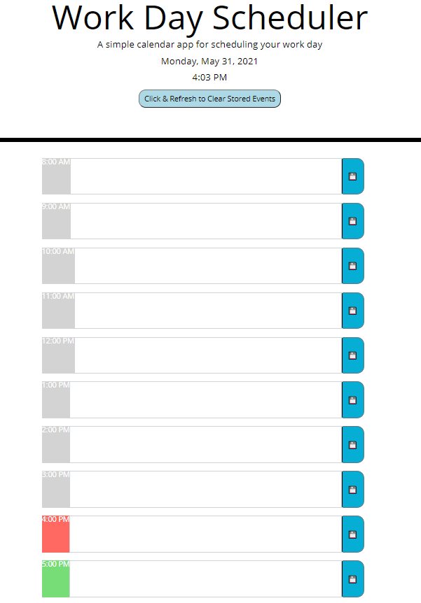

# Work-Day-Scheduler

This app allows the user to enter events in an hourly day planner. When the user opens the page, the hour rows should be color-coded for hours in the past, the current hour, and hours in the future. After inputing the event and pressing the save button, the event schedule should be saved in local storage and appear each time the user opens the page.

Deployed application:
https://shelleymcq.github.io/Work-Day-Scheduler/